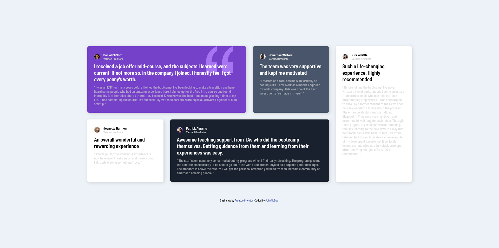

# Frontend Mentor - Testimonials grid section solution

This is a solution to the [Testimonials grid section challenge on Frontend Mentor](https://www.frontendmentor.io/challenges/testimonials-grid-section-Nnw6J7Un7). Frontend Mentor challenges help you improve your coding skills by building realistic projects. 

## Table of contents

- [Overview](#overview)
  - [The challenge](#the-challenge)
  - [Screenshot](#screenshot)
  - [Links](#links)
- [My process](#my-process)
  - [Built with](#built-with)
  - [What I learned](#what-i-learned)
  - [Continued development](#continued-development)
  - [Useful resources](#useful-resources)
- [Author](#author)
- [Acknowledgments](#acknowledgments)

**Note: Delete this note and update the table of contents based on what sections you keep.**

## Overview

### The challenge

Users should be able to:

- View the optimal layout for the site depending on their device's screen size

### Screenshot

### Links

- Solution URL: [Frontend Mentor Solutions](https://www.frontendmentor.io/solutions/responsive-testimonial-grid-built-with-htmlcss-grid-j9fEecrauA)
- Live Site URL: [GitHub Pages](https://johnmcdoe.github.io/testimonials-grid-section-main/)

## My process

### Built with

- Semantic HTML5 markup
- CSS custom properties
- Flexbox
- CSS Grid
- Mobile-first workflow

### What I learned

- How to use CSS Grid for layout

### Continued development

I'm going to do more layouts with CSS Grid until I'm comfortable with it.

### Useful resources

- [MDN Web Docs](https://developer.mozilla.org/en-US/) - A really good reference for anything related to HTML, CSS and JS.

## Author

- Frontend Mentor - [@JohnMcDoe](https://www.frontendmentor.io/profile/JohnMcDoe)

## Acknowledgments

I've learnt a lot about CSS Grid [from this YouTuber.](https://www.youtube.com/@KevinPowell)
He produces CSS-focused videos which are suited for beginners.

